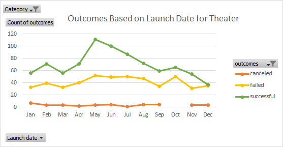

# An Analysis of Kickstarter Campaigns
Performing analysis on kickstarter data to uncover trends as I go through the lesson plans
### Challenge

ANALYSIS AND CONCLUSIONS: from data and chart on Outcomes Based on Launch Date (for Theater):
- The month of May appears to be the best time to launch a kickstarter campaign for the parent category, Theater, because May has the highest number of successful campaigns.
- The month of May also has the largest difference between number of successful campaigns and number of failed campaigns.  
- Therefore, off this data, it appears that May has the highest potential for success and the lowest relative risk of failure vs success.

ANALYSIS AND CONCLUSIONS from data and chart on Outcomes Based on Goals (for Plays):
- There is a good chance of success (73-76% success rate) for kickstarter campaigns with goals below $5,000.
- 21% of campaigns have goals of less than $1,000 (with 76% success rate of reaching desired goals), and 53% of campaigns have goals of $1,000 to $4,999 (with a 73% success rate), we have a combination of the highest success and the most campaigns raising money at these levels.
- In fact, the below $4,999 level is more fairly compared to the other $5,000 increments, in which case 74% of the kickstarter campaigns occur at this level with a 73-76% success rate.
- As the kickstarter fundraising goal for plays increases beyond $5,000 the chance of success declines and becomes more unpredictable and random, with a spike up to 75% at the $20,000-$24,999 level, however this is only with 4 data points, so far less reliable.  The lack of data points at these higher levels also shows that most people choose not to launch campaigns at these higher levels.
- While there are 109 projects that raised more than $50,000 they did so with only a 39% success rate, and this "row" is not really comparable to the rest of the rows which are in $5,000 increments whereas $50,000 and higher includes an infinite set of possibilities, so one might imagine if we kept up the $5,000 increments there would be many rows with zero or one entry.

RECOMMENDATIONS: Based on the data, it appears launching a kickstarter campaign in May for below $4,999, should yield the highest probability of success.

LIMITATIONS: 
- For the higher monetary increments, we do not have enough data points to really glean valuable conclusions
- The Launch Date Outcomes is for Theater category which includes plays but also includes campaigns for building out theaters, therefore the conclusion might have been different for only plays, thus the month of May may not actually be the right month to launch for plays.
- We also do not have a combined dataset showing the correlation between launch date and amount raised, for instance, were many of the successful May launches for the projects above $50,000 and therefore not relevant to a recommendation to launch in May and set a goal of under $4,999.
- We also did not divide this by geography to look at what months and amounts work best for the country in which the kickstarter campaign will take place.

ADDITIONAL TABLES/GRAPHS:
- Table showing launch dates combined with goal amounts at each date, so we could see what month is most successful at what amount.  Included in this table/graph would be the desired country (sort for US or UK) of launch, and it would be for plays as that removes theater space fundraisings.
- Data broken down into increments for amounts higher than $50,000 as there are 109 data points lumped in there now.
